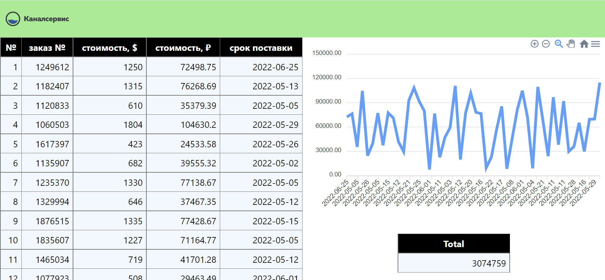

# MVP веб-приложения для отслеживания изменений в Google Sheet



Ссылка на страницу Google Sheet, откуда должен производиться парсинг данных - [googlesheet](https://bit.ly/3SAz6gY). На странице представлен импровизированный список заказов с их номерами, стоимостью в долларах и сроками поставки.

Приложние состоит из 3 частей: backend на Django, frontend на React.js и телеграм-бот. Запаковано в docker.

Backend отвечает за:
- парсинг google sheet странички с определенным интервалом
- запись данных парсинга в базу данных с расчетом стоимости в рублях
- раздача этих данных через api endpoint

Frontend овтечает за отображение в виде SPA:
- данных, запрашиваемых через API бэкенда
- линейного графика стоимости заказов
- общей суммы всех заказов в рублях

Бот отвечает за:
- отображение по команде общего числа и номеров просроченных заказов
- доставку уведомлений об общем числе просроченных заказов с определенным интервалом

## Запуск dev-версии приложения

У вас в системе должны быть установлены docker и docker-compose.

#### Клонируйте репозиторий и перейдите в него

```sh
git clone https://github.com/balancy/canalservice_orders.git
```

```sh
cd canalservice_orders
```

#### Задайте переменные окружения

Создайте файл `.env` в папке bot:

```sh
touch bot/.env
```

Откройте `bot/.env` файл любым редактором и пропишите телеграм токен, который можно получить у [t.me/BotFather](t.me/BotFather), в формате:

```sh
TELEGRAM_TOKEN=ваш_токен
```

#### Запуск приложения
```
docker-compose up -d --build
```

API будет доступно по адресу

[http://localhost:8080/orders/](http://localhost:8080/orders/)

SPA будет доступно по адресу

[http://localhost:3000/](http://localhost:3000/)

Бот будет доступен по адресу, заданному Вами через [t.me/BotFather](t.me/BotFather)
Начинайте взаимодействие с ним через команду '/start'.

#### Создайте суперпользователя для django admin

```
docker-compose exec django python manage.py createsuperuser
```

Админка django будет доступна по адресу

[http://localhost:8080/admin/](http://localhost:8080/admin/)

### Другие переменные окружения
Задавать эти переменные для локальной развертки не нужно.

#### backend/.env

- `SECRET_KEY` - секретный ключ для django. По умолчанию генерируется случайным образом.
- `DEBUG` - режим отладки. По умолчанию включен.
- `ALLOWED_HOSTS` - список разрешенных хостов. По умолчанию localhost.
- `ORDERS_GOOGLESHEET_ID` - id странички Google Sheet. По умолчанию предоставлено.
- `DB_REFRESH_INTERVAL` - интервал парсинга новых данных из Google Sheet. По умолчанию 10 секунд.

#### frontend/.env

- `REACT_APP_BACKEND_HOST` - имя хоста, откуда React запрашивает данные. По умолчанию localhost.
- `REACT_APP_REFRESH_INTERVAL_DURATION` - интервал обновления данных на странице.

#### bot/.env

- `NOTIFICATION_TIMEOUT` - интервал отправки уведомлений о просроченных ордерах. По умолчанию 60 минут.
